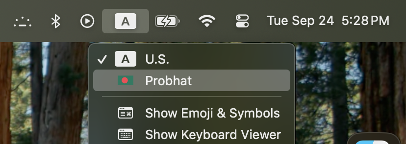
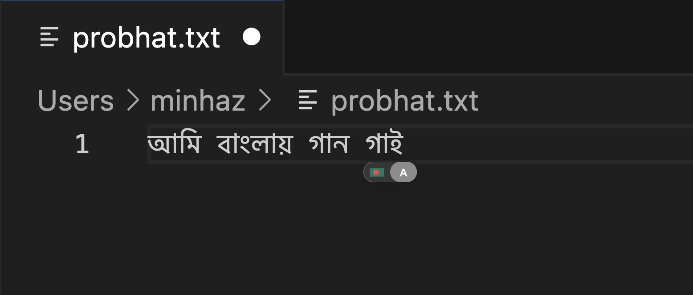

# Probhat

The Probhat (প্রভাত) keyboard layout is a free, Unicode-based, fixed-layout system for Bengali script, commonly found in Linux distributions.

Although its key mappings share similarities with phonetic layouts, Probhat employs a strictly fixed typing method.

This implementation is a custom XML-based layout for macOS, derived from the original Probhat.

Its key distinguishing feature is the integration of macOS keyboard shortcuts through specific hotkey combinations.

|CMD|ALT|CTRL|
|:---:|:---:|:---:|
|⌘|⌥|⌃|

Which means, even when `Probhat` layout is activated, you can still use `⌘+A` to select all, `⌘+C` to copy, `⌃+D` to send EOF or other `⌘+⌥` combinations.

## Layout


## Install (Tested upto macOS Sequoia 15)

Run the following command in Terminal.

```bash
curl https://raw.githubusercontent.com/mdminhazulhaque/probhat-osx/master/install.sh | sudo bash
```

Then enter your password so the installer script can copy the necessary files to `/Library/Keyboard\ Layouts` directory.

## Uninstall

Run the following command in Terminal.

```bash
curl https://raw.githubusercontent.com/mdminhazulhaque/probhat-osx/master/uninstall.sh | sudo bash
```

Now reboot or logout to apply the changes.

## Configure

1. Reboot, or log out and log in again after installing.
2. Open `System Preferences`. Then go to `Language & Region` > `Keyboard Preferences` > `Input Sources`.
3. Click the `+` sign, then select `Others` > `Probhat` with Bangladeshi flag.
4. Get back to `Keyboard Preferences` > `Shortcuts` > `Input Sources` and turn on `Select the previous input source` with shortcut key `⌘+Space`.
5. Now you will see `Probhat` on input method list on menu bar.

    
    
6. Hit any text editor, browser, Facebook or whatever, press `⌘+Space` and start typing Bangla in Probhat!

    

## Bugs

- [x] Numkeys not working in Bangla mode
- [x] Backtick (\`) does not work in Bangla mode by [@tareqmahmud](https://github.com/tareqmahmud)
- [x] ZWNJ Support by [@rabbihossain](https://github.com/rabbihossain)

## License

This keyboard layout is available under the [MIT](http://mths.be/mit) license.
